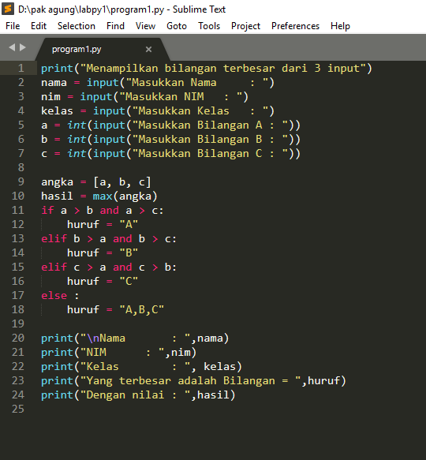
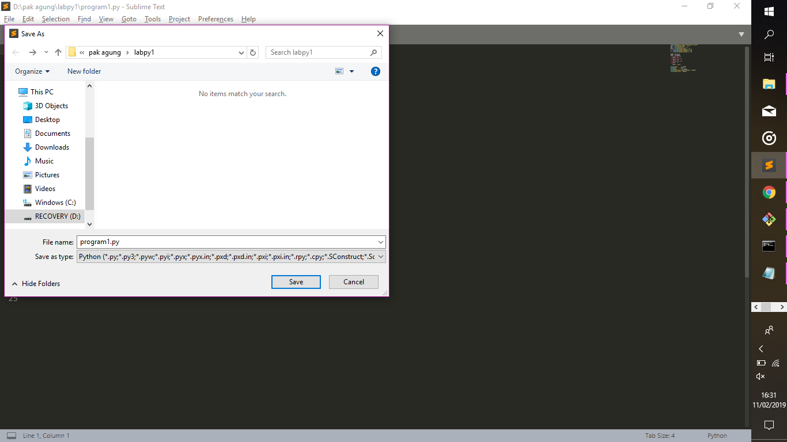
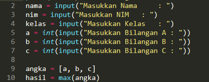
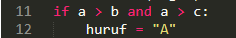
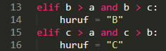
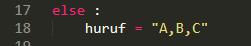
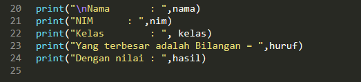
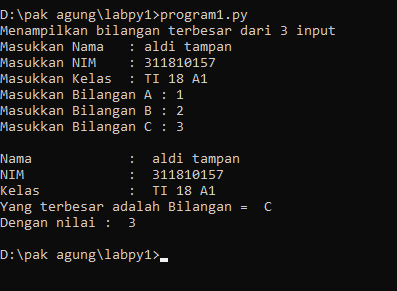

cara menampilkan bilangan terbesar dari 3 bilangan berbeda pada python

1. buka sublime text atau notepad untuk membuat program nya

2. setelah buka sublime text, buat atau masukan kode atau codingan nya

3. lalu save

4. berikut adalah penjelasan nya

a. input

b. if

c. elif

d. else

e. output

5. berikut adalah tampilan dari program nya

6. DONE/SELESAI (GAUSAH GAS)
